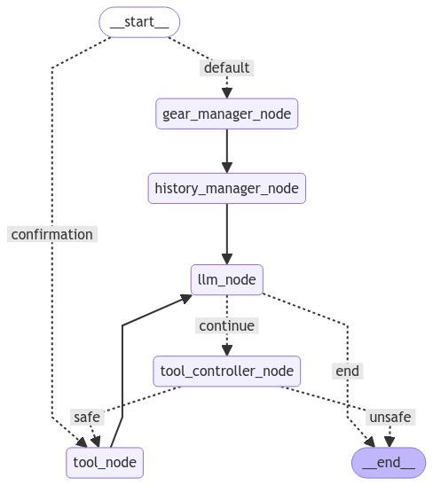

# mint_agent_demo

## Graph structure


## Installation
1. Install Poetry: https://python-poetry.org/docs/

2. Install Agent with Poetry
    ```
    poetry install
    ```

3. Prepare mongoDB database

4. Copy .env_example as .env and fill in required fields

    required fileds for now:
    ```
    # Anthropic API
    ANTHROPIC_API_KEY = <ANTHROPIC_API_KEY>

    # Agent Configuration
    LLM_PROVIDER = ANTHROPIC
    LLM_MODEL = claude-3-haiku-20240307

    #Agent mongo database
    MONGO_URI = <MONGO_DB_URI>
    DB_NAME = <DB_NAME>

    #MintHCM mysql database
    MINTDB_URI = <MINTDB_URI>
    MINTDB_PORT = <MINTDB_PORT>
    MINTDB_USER = <MINTDB_USER>
    MINTDB_PASS = <MINTDB_PASSWORD>
    MINTDB_DATABASE_NAME = <MINTDB_DATABASE_NAME>

    #MintHCM API
    MINT_API_URL = <MINT_API_URL>

    #Agent websocket API
    API_IP = <API_IP>
    API_PORT = <API_PORT>

    #Logging configuration
    LOG_LEVEL = <DEBUG|WARNING|ERROR>
    LOG_TO_CONSOLE = <TRUE|FALSE>
    LOG_FILE = e.g. /tmp/agent.log
    LOG_COLORING = <TRUE|FALSE>
    ```

5. Prepare database structure:
    1. Copy credentials.json_example as credentials.json and fill in required fields.
    
        Example:
        ```json
            [
              {
                "_id": "admin",
                "auth_token": "1",
                "mint_user_id": "1",
                "user_credentials": [
                  {
                    "system": "MintHCM",
                    "credential_type": "APIV8",
                    "credentials": {
                      "client_id": "...",
                      "secret": "..."
                    }
                  }
                ]
              }
            ]
        ```
    2. Run script to populate database:
        ```sh
        poetry run generate_credentials
        ```

## Running the App:

1. Run the app: 
    * Test chat widget:
        ```sh
        poetry run test_chat
        ```
    * Agent API (`dev` runs uvicorn with auto-reload enabled):
        ```sh
        poetry run dev | poetry run prod
        ```

2. Use test chat widget on `localhost:80` or connect to websocket: `ws://localhost:5288/<user_id>/<chat_id>/<token>?advanced=<advanced>` where:
    * **`user_id`**: User ID
    * **`chat_id`**: The ID of a chat, responsible for maintaining conversation history
    * **`token`**: User authentication token
    * **`advanced`**:
        * **true** -> sends information about using all tools
        * **false** -> hides information about using safe tools
    
    * *Usage example in python*
        ```python
        import websockets
        import asyncio

        async def connect():
            uri = "ws://localhost:5288/admin/new_chat_1/test_token_123?advanced=false"
            async with websockets.connect(uri) as websocket:
                await websocket.send("Hello, World!")
                response = await websocket.recv()
                print(response)

        asyncio.run(connect())
        ```