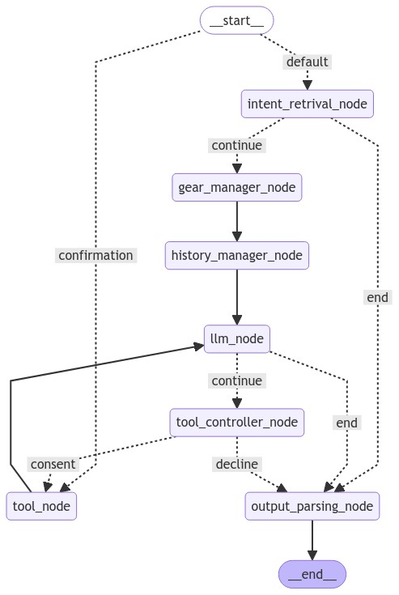

# mint_agent_demo

## Graph structure


## Getting started

* Set up envrinment with python ( Tested on: 3.12.4)

* Run on envrionment required installs:
pip install -r requirements.txt -U

* copy .env_example as .env and fill in reuiqred ids

* Run app:

    ```
    python app.py
    ```