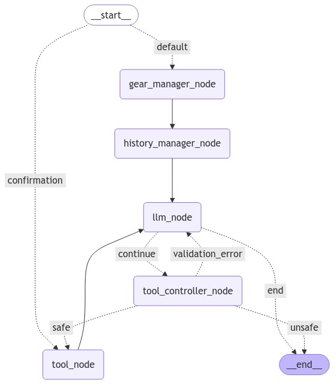

# AI HR Agent

## Description
Our agent, available as a chatbot, enables interaction with the MintHCM system through natural language communication. It operates as an external server accessible through a WebSocket API, utilizing the MintHCM API and direct database calls to accomplish its tasks. Users interact with the agent via the MintHCM chat widget, which provides a simple and intuitive communication interface. The agent is equipped with a set of tools that allow it to perform various operations, such as:
* Retrieving information about a user's calendar TODO: Screenshot? 
* Accessing data about users in the system TODO: Screenshot? 
* Creating new records, such as meetings, calls, or candidates TODO: Screenshot? 
* Updating existing records TODO: Screenshot? 

Additionally, a human-in-the-loop mechanism allows for human oversight of tool usage, enabling users to approve or decline the actions taken by agent to achieve a desired goal.

## Limitations

1. LLM non-determinism: Like any large language model, responses can vary and are not always deterministic. This leads to the fact that the agent doesn't always choose the correct tools, as it may try different approaches to reach a solution.
2. LLM compatibility: While our agent is designed to work with various LLMs, currently we provide interfaces only for OpenAI and Anthropic models. 
3. Tool restrictions: 
    * The lack of user consent for utilizing a tool at the moment makes the agent unlikely to attempt using that tool in further conversation. In such cases, it is recommended to create a new chat with a clean history.
    * Some tools are now restricted to operating only on certain modules due to the ease of testing and to narrow down options for the LLM so it provides more reliable results.
    * Instead of asking the user for missing information when using a certain tool, the agent can fabricate some details (e.g. function arguments)
4. Time handling: Currently, the agent can't deal with database date formats. This means that when your prompt includes dates, times, or any requests related to specific hours, the results can be inaccurate.
5. History management: Token-based history management works as a rough approximation and should not be considered a reliable method for systems aiming to limit token usage.

## Agent Structure
We are utilizing <a href="https://www.langchain.com/langgraph" target="_blank">LangGraph</a> to create the architecture of our agent. The following structure is a backbone of our solution:
<p align="center">

</p>

1. **gear_manager_node:** Currently responsible for setting the prompt in a new conversation.
2. **history_manager_node:** Depending on the selected history management method, it creates summaries and removes redundant messages.
3. **llm_node:** Responsible for communication with the chosen LLM API.
4. **tool_controller_node:** Verifies whether the tool selected by the LLM is on the list of safe tools.
5. **tool_node:** Executes the tool selected by the LLM.

## Available configuration

### Tools
All tools are located in a <code>tools</code> directory. ToolController defines and manages the tools available to the agent. It provides three configurable lists:
* <code>available_tools</code> - all tools defined in the system
* <code>default_tools</code> - tools accessible to the agent by default
* <code>safe_tools</code> - tools that do not require user acceptance

List of tools:
1. <code>MintCreateMeetingTool</code> - Schedules a new meeting in the system.
2. <code>MintCreateRecordTool</code> - Creates a new record in the specified module.
3. <code>MintCreateRelTool</code> - Establishes a relationship in the meetings module.
4. <code>MintDeleteRecordTool</code> - Deletes a record from the specified module.
5. <code>MintDeleteRelTool</code> - Removes a relationship from the meetings module.
6. <code>MintGetModuleFieldsTool</code> - Retrieves the fields and their types for the specified module.
7. <code>MintGetModuleNamesTool</code> - Retrieves all available modules in the system.
8. <code>MintGetRelTool</code> - Checks if relationship exists in the meetings module.
9. <code>MintGetUsersTool</code> - Retrieves a list of users in the system, including details like phone number, address, email, position, and supervisor.
10. <code>MintSearchTool</code> - Retrieves a list of records from a specified module.
11. <code>MintUpdateFieldsTool</code> - Updates fields in a specified module.
12. <code>CalendarTool</code> - Retrieves today's date.
13. <code>AvailabilityTool</code> - Retrieves data about a user's planned activities (meetings and/or calls).


### Mint modules available to agent
Agent can get a list of modules that are available in Mint via the MintGetModuleNames tool. This tool has the option to configure a white and a black list of modules. When both lists are not used, the agent will, by default, have access to all modules. 

### Prompts
Changes to system prompts, as well as the prompts used during conversation history summarization, can be made in:
<code>mint_agent/prompts/PromptController.py</code>

Additionally, each tool may have its own specific fields and general description prompt within their respective files located in:
<code>mint_agent/tools</code>

### History Management
At the moment, there are 4 types of message history management available for LLMs: 2 based on the number of messages and 2 based on the number of tokens used. 
* Message-based methods:
  1. <code>KEEP_N_MESSAGES</code> -> Keep only a fixed number of messages in memory (can vary to maintain history integrity, e.g. human message must be first message in the history).
  2. <code>SUMMARIZE_N_MESSAGES</code> -> Create summary after reaching certain number of messages.
* Token-based methods:
  1. <code>KEEP_N_TOKENS</code> -> Keep only messages that do not exceed a fixed number of tokens in memory.
  2. <code>SUMMARIZE_N_TOKENS</code> -> Create summary after reaching certain number of tokens.

## Installation

### Mint Prerequisites TODO:

1. TODO
2. TODO

### Agent

1. Install Poetry: https://python-poetry.org/docs/

2. Prepare mongoDB database

3. Install all dependencies:
    ```
    poetry install
    ```

4. Copy <code>.env_example</code> as <code>.env</code> and fill in required fields

5. Setting up credentials:
    1. Copy <code>mint_agent/credentials.json_example</code> as <code>mint_agent/credentials.json</code> and fill in required fields.

    2. Run script to populate database:
        ```sh
        poetry run generate_credentials
        ```

## Running the Agent:

1. Run the agent in preffered mode: 
    * Agent API (`dev` runs uvicorn with auto-reload enabled):
      ```sh
      poetry run dev # For development mode
      poetry run prod # For production mode
      ```
    * (Optional) Chat to test the agent without the need to use chat in MintHCM:
      ```sh
      poetry run test_chat
      ```
2. TODO MINT: 